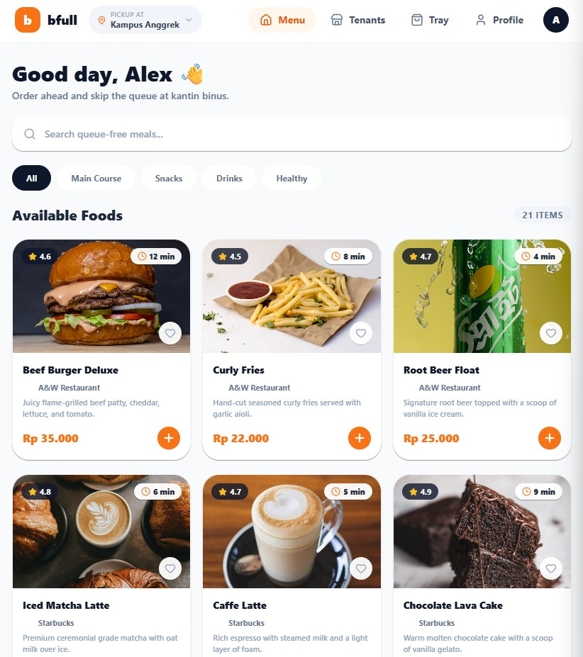
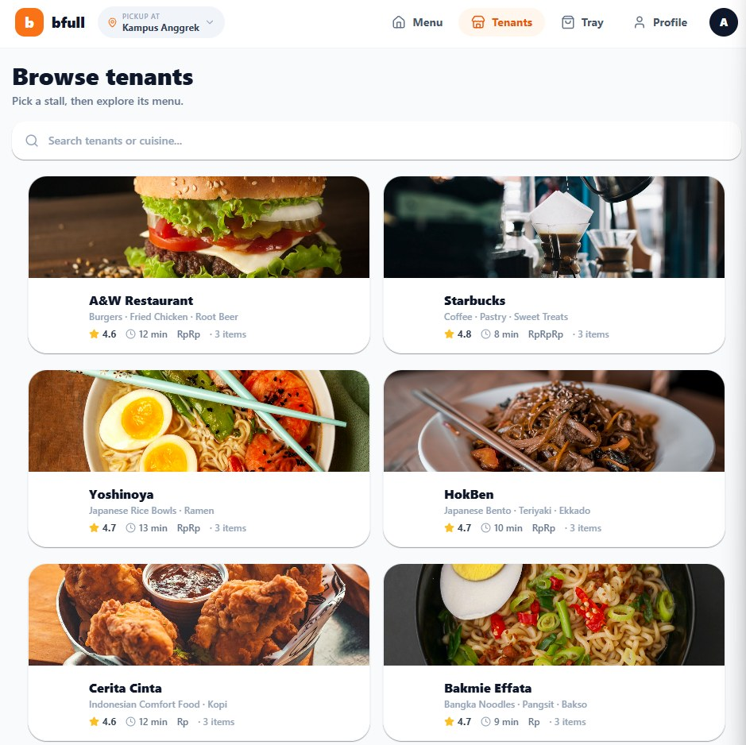
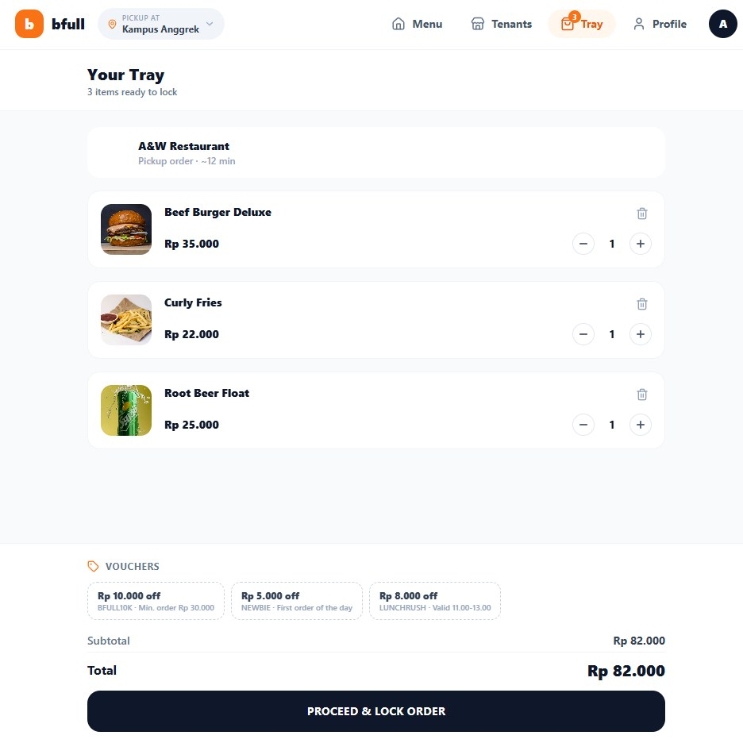
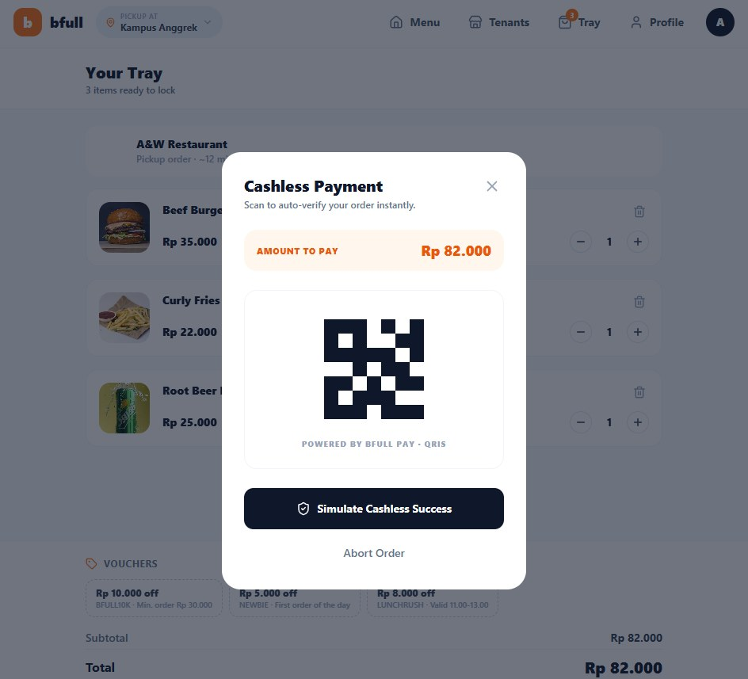
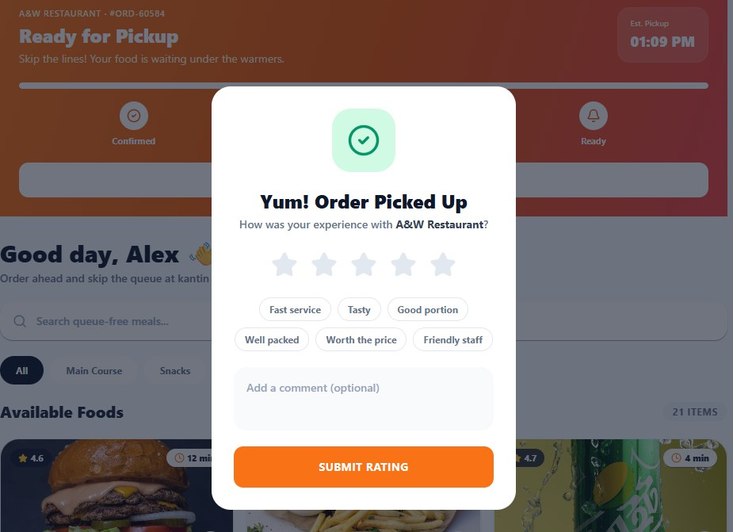
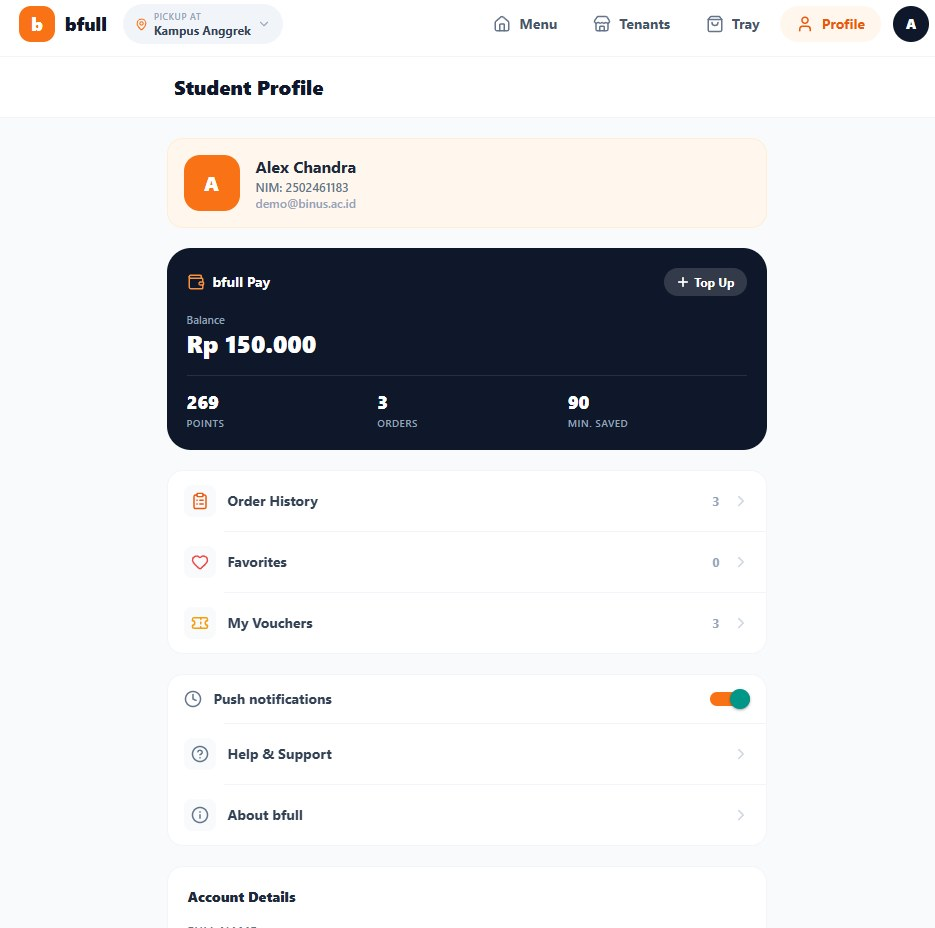
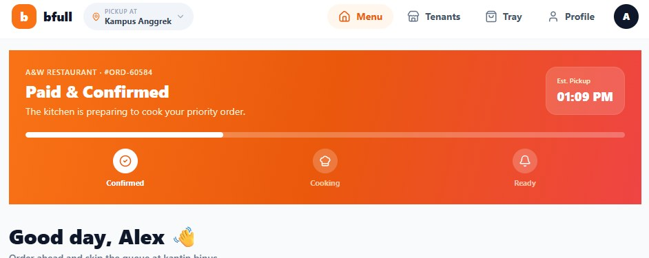
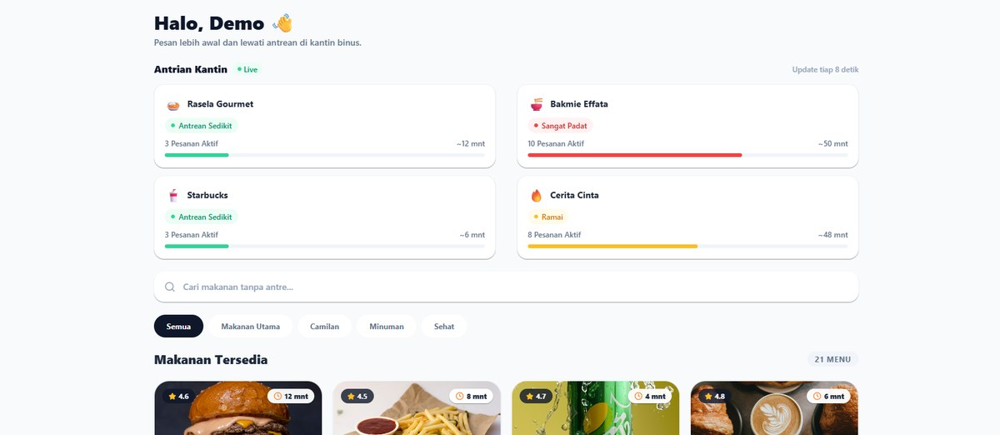

# bfull — aplikasi pesan makanan kantin BINUS

Prototipe aplikasi untuk memesan makanan di kantin BINUS tanpa perlu mengantre. Mahasiswa memilih tenant, memesan lewat aplikasi, membayar secara nontunai, lalu memantau status pesanannya sampai siap diambil.

Dibuat untuk mata kuliah Human and Computer Interaction (COMP6800001). Satu kode dipakai untuk web dan Android, memakai Expo (React Native).

Demo web: https://bfull-master.vercel.app/


## Catatan tentang proyek ini

Aplikasi ini dibuat untuk tugas kelompok mata kuliah Human and Computer Interaction. Seluruh perancangan dan penulisan kodenya saya kerjakan sendiri. Sebagian commit di repo kelompok tercatat atas nama rekan satu kelompok karena dia yang menjalankan push saat itu.

Repo ini berisi versi dengan tampilan berbahasa Inggris.

## Tampilan

| Beranda | Daftar tenant |
|---|---|
|  |  |
| **Tray** | **Pembayaran QRIS** |
|  |  |
| **Ulasan setelah pesanan diambil** | **Profil dan bfull Pay** |
|  |  |

Pelacak pesanan di bagian atas beranda:



Papan antrean kantin, diambil dari versi berbahasa Indonesia:



## Masalah yang diselesaikan

Waktu istirahat di antara kelas hanya sekitar 20 sampai 30 menit, dan hampir semua mahasiswa istirahat di jam yang sama. Kantin jadi penuh, waktu habis untuk mengantre dan menunggu makanan dimasak, dan pembeli sering baru tahu menu favoritnya habis setelah sampai di depan kasir. bfull memindahkan pemesanan dan pembayaran ke aplikasi, dan menampilkan keramaian setiap tenant serta perkiraan waktu siap, sehingga pengguna cukup datang saat makanan sudah siap.

Pengguna utamanya mahasiswa dengan jadwal padat. Dosen dan staf yang enggan berdesakan di jam makan siang juga termasuk target pengguna.

## Fitur

- Masuk dan daftar dengan email `@binus.ac.id`, lengkap dengan akun demo.
- Pemilihan kampus, mencakup delapan kampus BINUS.
- Dua cara menjelajah menu: per tenant (A&W, Starbucks, Yoshinoya, dan lainnya) atau lewat daftar menu dengan pencarian dan filter kategori.
- Halaman detail makanan dengan catatan khusus untuk penjual.
- Keranjang yang hanya boleh berisi satu tenant, dengan konfirmasi saat pengguna mau memesan dari tenant lain.
- Voucher potongan harga dan total yang berubah langsung saat jumlah pesanan diubah.
- Pembayaran nontunai dengan QRIS.
- Pelacak pesanan dengan tiga tahap: dikonfirmasi, dimasak, siap diambil.
- Papan antrean kantin yang menunjukkan tingkat keramaian setiap tenant dan perkiraan waktu tunggu.
- Pemberitahuan keterlambatan pesanan.
- Penilaian bintang, tag cepat, dan komentar setelah pesanan diambil.
- Favorit, riwayat pesanan, dompet, dan poin.
- Data tersimpan di perangkat, sehingga tetap ada setelah aplikasi ditutup.
- Tampilan menyesuaikan perangkat: menu atas dan tata letak beberapa kolom di web, tab bawah di ponsel.

## Keputusan desain

- **"Tray", bukan "Cart".** Nampan adalah benda yang memang dipakai membawa makanan di kantin, jadi fungsinya langsung dipahami.
- **Satu tenant per Tray.** Setiap tenant memasak dan menyerahkan pesanannya sendiri, jadi pesanan dari beberapa tenant akan punya waktu siap dan tempat ambil yang berbeda. Saat pengguna menambah menu dari tenant lain, aplikasi meminta konfirmasi dulu.
- **Tombol bayar tidak muncul saat Tray kosong**, supaya transaksi tidak bisa dimulai tanpa pesanan.
- **Warna oranye hanya untuk tombol aksi utama**, seperti tombol tambah, Browse Menu, dan Submit Rating, supaya pengguna tahu apa yang bisa ditekan.
- **Menu navigasi dan susunan kartu yang sama di setiap halaman**, supaya informasi seperti harga dan waktu tunggu selalu ada di posisi yang sama.

## Pengujian pengguna

Prototipe diuji oleh 20 mahasiswa BINUS (11 lewat laptop, 9 lewat ponsel), masing-masing sekitar 3 sampai 10 menit. Penguji diminta masuk, memilih menu, mengisi Tray, membayar dengan QRIS, dan melacak pesanan tanpa panduan tambahan, lalu mengisi kuesioner skala 1 sampai 5.

| Pernyataan | Rata-rata (1-5) |
|---|---|
| Bisa memakai aplikasi tanpa petunjuk tambahan | 4,75 |
| Alur dari masuk sampai melacak pesanan terasa logis | 4,45 |
| Tampilan nyaman dan tidak membingungkan | 4,45 |
| Kepuasan keseluruhan | 4,80 |
| Bersedia memakai kalau diterapkan di kantin BINUS | 4,80 |

Sebanyak 11 penguji memperkirakan aplikasi ini menghemat 8 sampai 12 menit waktu istirahat, dan 5 lainnya lebih dari 12 menit. Lebih dari 90% penguji menyelesaikan semua tugas tanpa kendala, dan satu penguji sempat bingung di halaman Tray. Masukan terbanyak: pembayaran langsung lewat dompet digital seperti GoPay, informasi gizi di setiap menu, dan layanan antar ke kelas.

Pengujian ini dilakukan bersama kelompok. Pengujinya sedikit dan direkrut sendiri, dan skornya berasal dari penilaian penguji, jadi hasilnya lebih tepat dibaca sebagai umpan balik awal daripada ukuran kegunaan yang ketat.

## Teknologi

- Expo SDK 56 dan Expo Router untuk navigasi berbasis file
- React Native 0.85, React 19, TypeScript
- NativeWind v4 (Tailwind CSS untuk React Native)
- AsyncStorage untuk menyimpan data di perangkat
- expo-image, expo-linear-gradient, dan ikon lucide-react-native

## Cara menjalankan

Butuh Node 18 atau lebih baru.

```bash
npm install

# Buka di browser
npm run web

# Buka di ponsel: pasang aplikasi Expo Go, lalu pindai QR yang muncul
npm start
```

Memeriksa tipe TypeScript: `npm run typecheck`

### Akun demo

Di halaman masuk, tekan tombol akun demo, atau isi sendiri:

```
Email:      demo@binus.ac.id
Kata sandi: bfull2026
```

Email apa pun yang berakhiran `@binus.ac.id` juga bisa dipakai.

## Cara membuat versi siap pakai

Versi web dan Android dibuat lewat layanan EAS milik Expo, dan butuh akun Expo sendiri.

```bash
npm install -g eas-cli
eas login
eas init

npm run deploy:web    # menerbitkan versi web
npm run build:apk     # membuat file APK untuk Android
```

Repo ini juga punya alur GitHub Actions di `.github/workflows/deploy-web.yml` yang menerbitkan ulang versi web setiap ada push ke branch utama.

## Struktur folder

```
app/                    halaman aplikasi (Expo Router)
  _layout.tsx           penyedia state dan susunan navigasi
  index.tsx             layar pembuka dan pemeriksaan login
  login.tsx             halaman masuk
  register.tsx          halaman daftar
  campus.tsx            pemilihan kampus
  (tabs)/               tab bawah: kantin, keranjang, profil
    index.tsx           beranda: pelacak pesanan, pencarian, daftar menu
    tenants.tsx         daftar tenant
    cart.tsx            keranjang
    profile.tsx         profil, dompet, dan poin
  tenant/[id].tsx       halaman satu tenant
  food/[id].tsx         detail makanan
  payment.tsx           pembayaran QRIS
  review.tsx            penilaian setelah pesanan diambil
  orders.tsx            riwayat pesanan
  favorites.tsx         daftar favorit
  vouchers.tsx          daftar voucher
components/             komponen tampilan: kartu makanan, kartu tenant,
                        pelacak pesanan, papan antrean, modal keterlambatan, toast
lib/                    tipe data, menu contoh, format angka, dan state aplikasi
```

## Keterbatasan

- Ini prototipe untuk tugas kuliah, bukan aplikasi yang benar-benar terhubung ke kantin.
- Menu, tenant, dan antrean memakai data contoh yang ditulis di dalam kode, bukan data asli.
- Pembayaran QRIS hanya tampilan, tidak ada transaksi sungguhan.
- Data pesanan disimpan di perangkat masing-masing, sehingga tidak bisa dilihat oleh tenant.

## Pelajaran dari proyek ini

- Memusatkan prototipe awal pada alur inti (memilih menu, membayar, melacak pesanan), lalu baru membuat halaman pendukung seperti profil dan voucher setelah alur inti tervalidasi.
- Lebih banyak iterasi di Figma sebelum menulis kode, karena mengubah tata letak di desain jauh lebih cepat daripada di kode.
- Menguji aplikasi langsung di kantin saat jam sibuk. Masalah utamanya adalah waktu yang mepet di tengah keramaian, dan kondisi itu tidak muncul saat pengujian di tempat yang tenang.

## Lisensi

MIT, mengikuti template awal Expo. Lihat file `LICENSE`.
